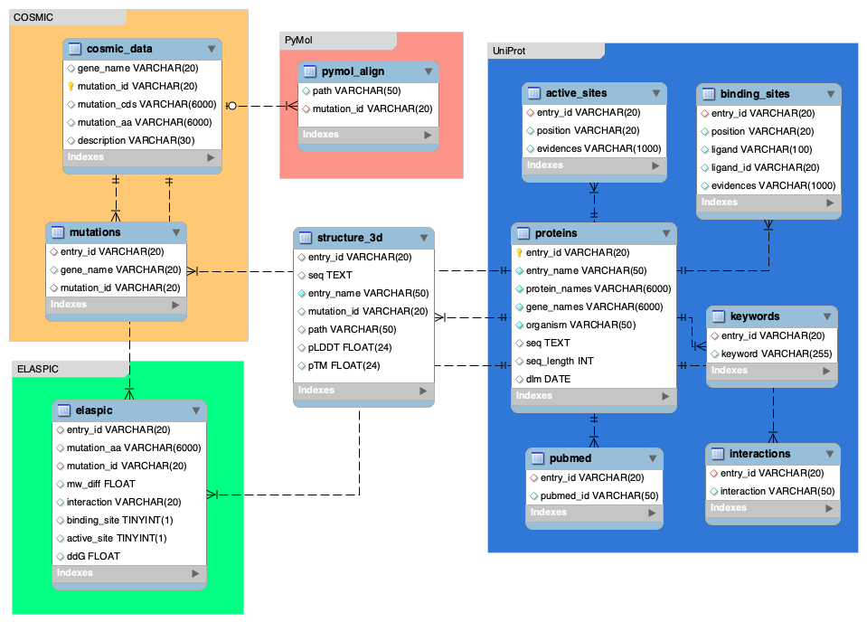

# MutFold


## About MutFold

**MutFold** was created to visualize & compare the 3D protein structure of mutant proteins related to human breast cancer. [**Evolutionary Scale Modeling (ESMFold)**](https://github.com/facebookresearch/esm) from Meta was used to predict 3D protein structures for both wild types and mutants. Alignments between mutant and wild-type proteins were performed using [**PyMol**](https://pymol.org/2/) software. To further assess the effect of mutation on protein, [**ELASPIC**](http://elaspic.kimlab.org/help/) tool was used to predict the impact of protein affinity towards related proteins.

## Resources

**MutFold** contains a 3D protein structure of 2314 proteins (251 wild-type proteins (protein length < 989bp) and 2063 mutant proteins. Proteins with sequences longer than 989bp showed a rapid decrease in prediction score, hence, limiting the length to 988bp. However, it is important to consider that the prediction was done using the default parameters of the model provided by the ESMFold repository and parameters might not be optimal for longer sequences. All proteins related to breast cancer and mutations were retrieved from [**UniProt**](https://www.uniprot.org/) and [**COSMIC**](https://cancer.sanger.ac.uk/cosmic) respectively. For the database, MySQL was used to store information gathered from above resources.

## 3D Protein Structure Prediction with ESMFold

For the setup and the prediction, I referred to the instruction provided by [ESMFold](https://github.com/facebookresearch/esm/tree/main).

#### 1. Setup a Conda environment for ESMFold

```bash
# Create a virtual conda environment
conda create -f environment.yml
conda install pytorch torchvision torchaudio pytorch-cuda=11.7 -c pytorch -c nvidia

# Activate conda environment
conda activate

# Finish ESMFold setup
pip install "fair-esm[esmfold]"
# NOTE: If openfold installation fails, please double check that nvcc is available and that a cuda-compatable version of PyTorch has been installed.
pip install 'dllogger @ git+https://github.com/NVIDIA/dllogger.git'
pip install 'openfold @ git+https://github.com/aqlaboratory/openfold.git@4b41059694619831a7db195b7e0988fc4ff3a307'
```

#### 2. Run prediction

```bash
# (If needed) change model & weights directory before loading the model
torch.hub.set_dir('<directory>')

# NOTE: need to debug seed.py from openfold (import seed_everything deprecated)
# NOTE: need to debug deepseed (import torch._six deprecated)
python3 esm/scripts/fold.py -i ../data/ESM_fold_entry_filtered_988.fasta -o ../data/structures/ --max-tokens-per-batch 0 --cpu-offload >> esmfold.log
```

## Alignment of proteins with PyMol Software

With the help of PyMol software, we can align wild-type and mutant proteins. You can download PyMol software from [here](https://pymol.org/2/). Once the software is installed, the license is needed to run the alignment. Get a license (educational-use-only) from [here](https://pymol.org/edu/). Then, run the following code with the given code.

```bash
# Add PyMOL to the PATH (e.g., for MacOS)
alias pymol=/Applications/PyMOL.app/Contents/MacOS/PyMOL
# Make sure all the protein structures are located in the 'data/structures' directory
# and, 'mutation_info.tsv' and 'protein_alignment.py' are in the same location.
pymol -cq protein_alignment.py
```

## Create a MySQL Database

Once protein structures and alignment files are ready, you can create a MySQL database.

**Database Schema:**



Use the following Python codes to create your the database:

- [create_db.py](create_db.py)
- [create_tables.py](create_tables.py)


## Run a Streamlit App

Create a '.streamlit/secrets.toml'

```TOML
# .streamlit/secrets.toml
[mysql]
host = "localhost"
port = 3306
database = "cancer_uniprotdb"
user = "<username>"
password = "<password>"
```

Run the app

```bash
streamlit run ./streamlit/Home.py
```